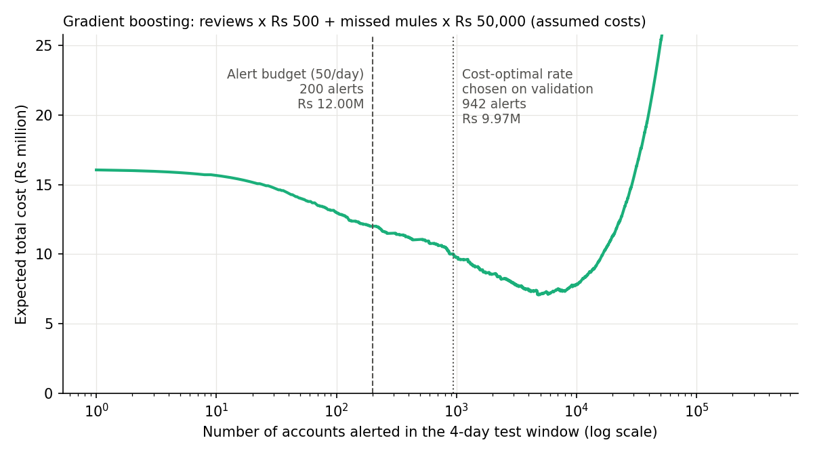
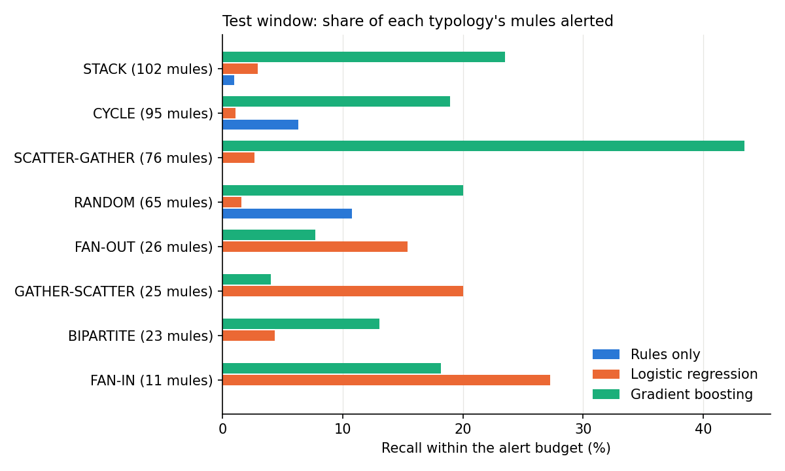
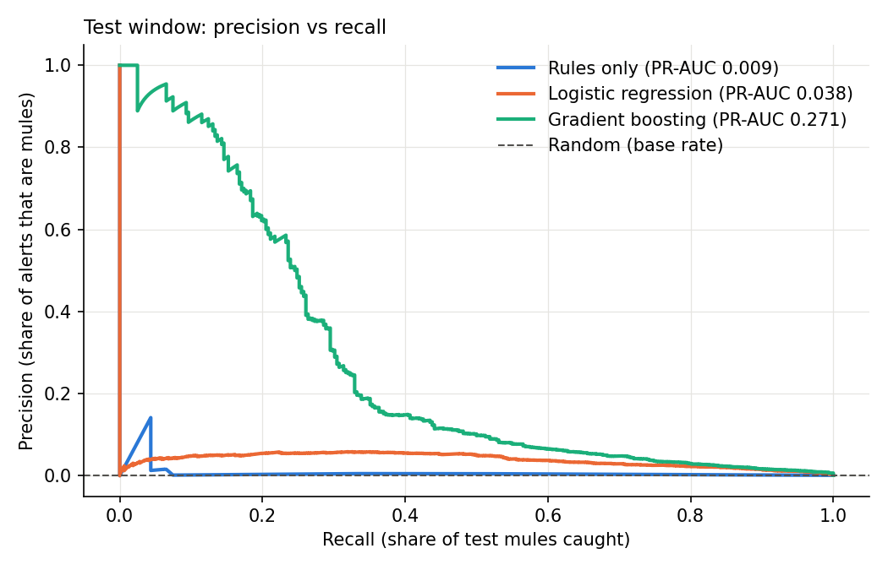

# MuleWatch results

Generated by `python -m src.evaluate` from an actual pipeline run. **Do not edit by hand.**
Data is IBM's synthetic AML dataset (HI-Small), not real or Indian bank data.

## Setup
- Data processed: 5,077,237 transactions from Sep 1-10 (4,522 marked laundering)
  across 515,078 accounts; the file has 5,078,345 rows (Sep 11-18 dropped as a simulator artifact).
- Label B (pass-through mule): received AND sent at least 1 laundering transfer in the window.
- Train: Sep 1-6 (340 mules; 3,131 grey accounts left out of training).
  Tuning: fit on Sep 1-4 (153 mules), judged on Sep 5-6 (88 mules).
- **Test: Sep 7-10, 367,656 accounts, 322 mules, base rate 0.088%.** Scored once.
- 25 model features. Dropped as constant: none.
- Chosen settings (on validation): {"gradient_boosting": {"learning_rate": 0.1, "max_depth": 6, "max_iter": 200}, "logistic_regression": {"C": 10.0}, "logistic_regression_v1": {"C": 10.0}, "rules": {}}.
- **Primary model, chosen on validation PR-AUC before testing: Gradient boosting.**
- Alert budget: 50 alerts/day x 4 days = 200 alerts. Best possible recall at this budget: 62.1%.
- Costs are ASSUMPTIONS: Rs 500 per review, Rs 50,000 per missed mule.
- **Post-hoc fix, disclosed:** the first test run showed that logistic regression's six payment-format shares always
  sum to 1 (collinear), which made its weights unstable and its reason codes meaningless. `fmt_cheque_share` was then
  dropped as the baseline category (no other change), re-tuned on validation, and the test set scored again.
  "LR v1" in the tables is the original run. The primary model did not change; gradient boosting was chosen on validation both times.

## Headline
At 50 alerts/day, Gradient boosting caught **84 of 322 test mules
(26.1% recall) at 42.0% precision**. A further
12 of the 200 alerts were grey accounts (touched laundering money without being pass-through).

## 1. Ranking quality (test)
PR-AUC of a random ranking equals the base rate (0.00088).

| | PR-AUC | PR-AUC / base rate | ROC-AUC | validation PR-AUC |
|---|---|---|---|---|
| Rules only | 0.009 | 10.329 | 0.71 | 0.054 |
| Logistic regression | 0.038 | 43.868 | 0.979 | 0.047 |
| Gradient boosting | 0.271 | 309.875 | 0.986 | 0.383 |
| LR v1 (collinear shares, superseded) | 0.038 | 43.58 | 0.979 | 0.047 |

## 2. Alert budget and sensitivity (test)
"25/day" and "100/day" show what happens if analyst capacity is halved or doubled.

| | alerts | mules caught | precision % | recall % | grey among alerts | clean false alarms |
|---|---|---|---|---|---|---|
| 25/day | Rules only | 100 | 14 | 14 | 4.35 | 2 | 84 |
| 25/day | Logistic regression | 100 | 2 | 2 | 0.62 | 21 | 77 |
| 25/day | Gradient boosting | 100 | 63 | 63 | 19.57 | 4 | 33 |
| 25/day | LR v1 (collinear shares, superseded) | 100 | 2 | 2 | 0.62 | 21 | 77 |
| 50/day | Rules only | 200 | 14 | 7 | 4.35 | 11 | 175 |
| 50/day | Logistic regression | 200 | 6 | 3 | 1.86 | 23 | 171 |
| 50/day | Gradient boosting | 200 | 84 | 42 | 26.09 | 12 | 104 |
| 50/day | LR v1 (collinear shares, superseded) | 200 | 6 | 3 | 1.86 | 24 | 170 |
| 100/day | Rules only | 400 | 14 | 3.5 | 4.35 | 25 | 361 |
| 100/day | Logistic regression | 400 | 16 | 4 | 4.97 | 46 | 338 |
| 100/day | Gradient boosting | 400 | 102 | 25.5 | 31.68 | 20 | 278 |
| 100/day | LR v1 (collinear shares, superseded) | 400 | 16 | 4 | 4.97 | 46 | 338 |

## 3. Cost-based threshold (test, assumed costs)
The cost-optimal alert rate is chosen on validation and then applied to test. The hindsight optimum on test is shown only for reference; it was not used to choose anything.

| | alert nobody (Rs) | budget 50/day (Rs) | cost-optimal alerts/day (chosen on validation) | cost at that rate on test (Rs) | hindsight best alerts/day on test (not used) | hindsight best cost (Rs) |
|---|---|---|---|---|---|---|
| Rules only | 16,100,000 | 15,500,000 | 59.5 | 15,519,000 | 23.5 | 15,447,000 |
| Logistic regression | 16,100,000 | 15,900,000 | 731.5 | 9,813,000 | 2,402.8 | 8,605,500 |
| Gradient boosting | 16,100,000 | 12,000,000 | 235.5 | 9,971,000 | 1,204.8 | 7,059,500 |

## 4. Recall per laundering typology (test, within the alert budget)
A mule counts toward every typology it took part in. UNTAGGED = mules in no Patterns.txt scheme (Patterns covers about 62% of laundering transfers).

| | mules | Rules only recall % | Logistic regression recall % | Gradient boosting recall % |
|---|---|---|---|---|
| STACK | 102 | 1 | 2.9 | 23.5 |
| CYCLE | 95 | 6.3 | 1.1 | 18.9 |
| SCATTER-GATHER | 76 | 0 | 2.6 | 43.4 |
| RANDOM | 65 | 10.8 | 1.5 | 20 |
| FAN-OUT | 26 | 0 | 15.4 | 7.7 |
| GATHER-SCATTER | 25 | 0 | 20 | 4 |
| BIPARTITE | 23 | 0 | 4.3 | 13 |
| FAN-IN | 11 | 0 | 27.3 | 18.2 |
| UNTAGGED | 2 | 0 | 50 | 0 |

### What kind of mule is missed? (Gradient boosting, medians of test mules inside vs outside the alert budget)
| | mules | transfers in window | fmt_ach_share | pass_through_ratio | dwell_median_hours | fan_in_per_day | fan_out_per_day | share with > 20 transfers |
|---|---|---|---|---|---|---|---|---|
| caught | 84 | 3 | 1 | 1 | 28.03 | 0.25 | 0.25 | 0.01 |
| missed | 238 | 16.5 | 0.25 | 0.94 | 8.52 | 0.5 | 0.5 | 0.39 |

## 5. Example alerts (Gradient boosting, within the alert budget)
### True positives (top-ranked mules)
| rank | account_id | gradient_boosting | is_grey | rule reason codes | LR top drivers | pass_through_ratio | dwell_median_hours | fan_in_per_day | fan_out_per_day | senders_pass_through_share | receivers_pass_through_share | short_cycles_per_day |
|---|---|---|---|---|---|---|---|---|---|---|---|---|
| 1 | 022758_802716DD0 | 0.9999 | 0 | RAPID_PASS_THROUGH: forwarded 97% of incoming money, median wait 45.2h | fmt_ach_share (+4.2), has_dwell (+3.2), cross_bank_out_share (+2.6) | 0.9700 | 45.2300 | 0.2500 | 0.2500 | 0.0000 | 0.0000 | 0.0000 |
| 2 | 012719_807214430 | 0.9999 | 0 | RAPID_PASS_THROUGH: forwarded 97% of incoming money, median wait 39.4h | fmt_ach_share (+4.2), has_dwell (+3.2), cross_bank_out_share (+2.6) | 0.9700 | 39.3700 | 0.2500 | 0.2500 | 1.0000 | 0.0000 | 0.0000 |
| 3 | 023537_802929810 | 0.9999 | 0 | (no rule fired) | fmt_ach_share (+4.2), has_dwell (+3.2), cross_bank_out_share (+2.6) | 0.9100 | 55.4700 | 0.2500 | 0.2500 | 0.0000 | 0.0000 | 0.0000 |
| 4 | 001267_802FBEBC0 | 0.9999 | 0 | (no rule fired) | fmt_ach_share (+4.2), has_dwell (+3.2), cross_bank_out_share (+2.6) | 1.0100 | 55.8300 | 0.2500 | 0.2500 | 0.0000 | 0.0000 | 0.0000 |
| 5 | 0223_811B86440 | 0.9999 | 0 | RAPID_PASS_THROUGH: forwarded 102% of incoming money, median wait 34.0h; CROSS_BANK_HOPS: all 2 outgoing transfers went to other banks | fmt_ach_share (+4.2), has_dwell (+3.2), cross_bank_out_share (+2.6) | 1.0200 | 34.0300 | 0.2500 | 0.2500 | 1.0000 | 0.0000 | 0.0000 |

### False positives (top-ranked non-mules)
| rank | account_id | gradient_boosting | is_grey | rule reason codes | LR top drivers | pass_through_ratio | dwell_median_hours | fan_in_per_day | fan_out_per_day | senders_pass_through_share | receivers_pass_through_share | short_cycles_per_day |
|---|---|---|---|---|---|---|---|---|---|---|---|---|
| 9 | 020_8000FF830 | 0.9998 | 1 | RAPID_PASS_THROUGH: forwarded 86% of incoming money, median wait 37.2h | fmt_ach_share (+4.2), has_dwell (+3.2), cross_bank_out_share (+2.6) | 0.8600 | 37.2500 | 0.2500 | 0.2500 | 0.0000 | 0.0000 | 0.0000 |
| 23 | 022_811CB0310 | 0.9992 | 0 | RAPID_PASS_THROUGH: forwarded 97% of incoming money, median wait 14.8h; NEW_AND_BURSTY: first seen 64% into the window, 100% of activity in one 24h stretch | fmt_ach_share (+4.2), has_dwell (+3.2), cross_bank_out_share (+2.6) | 0.9700 | 14.7800 | 0.2500 | 0.2500 | 0.0000 | 0.0000 | 0.0000 |
| 27 | 001299_80257B610 | 0.9991 | 0 | CROSS_BANK_HOPS: all 2 outgoing transfers went to other banks | fmt_ach_share (+4.2), has_dwell (+3.2), cross_bank_out_share (+2.6) | 1.2400 | 14.7800 | 0.2500 | 0.2500 | 0.0000 | 0.0000 | 0.0000 |

## 6. Logistic regression weights (standardised; positive = pushes towards mule)
| | weight |
|---|---|
| round_amount_share | -6.477 |
| fmt_bitcoin_share | -5.407 |
| ccy_mismatch_share | -3.119 |
| cross_bank_out_share | 2.827 |
| burst_share | -1.968 |
| has_dwell | 1.918 |
| fmt_ach_share | 1.701 |
| fan_in_per_day | 1.637 |
| first_seen_frac | 1.538 |
| fan_out_per_day | 0.997 |
| in_usd_per_day | 0.801 |
| out_count_per_day | -0.661 |
| in_count_per_day | -0.632 |
| amount_cv | -0.468 |
| dwell_median_hours | 0.467 |
| fmt_credit_card_share | -0.368 |
| fmt_cash_share | 0.25 |
| out_usd_per_day | 0.246 |
| receivers_pass_through_share | 0.199 |
| senders_pass_through_share | 0.196 |
| fmt_wire_share | 0.157 |
| short_cycles_per_day | 0.108 |
| pagerank_scaled | 0.096 |
| pass_through_ratio | -0.084 |

